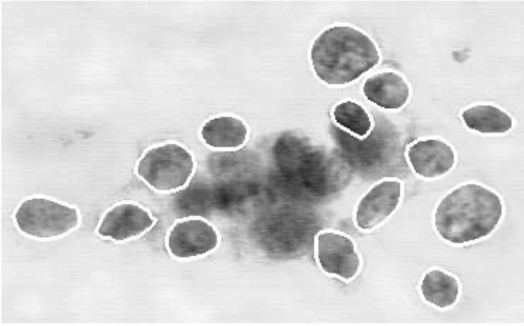
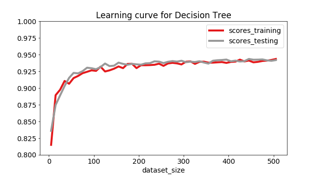
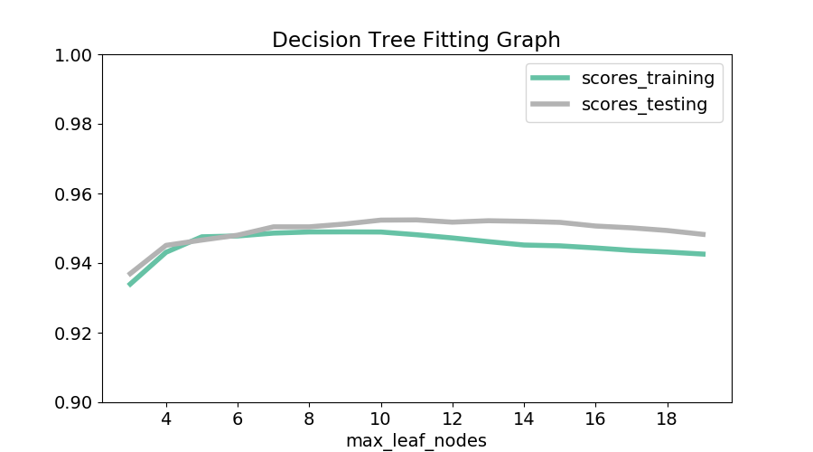

## Problem Statement
Can we use linear classification to predict malignant cancer cells knowing the geometric properties of the cell nuclei?

## Data Source
Wisconsin Breast Cancer Database (January 8, 1991), Dr. William H. Wolberg [archive](https://archive.ics.uci.edu/ml/datasets/Breast+Cancer+Wisconsin+(Diagnostic)). Breast cells were collected from patients with a technique known as fine needle aspirate (FNA) and analysed under a microscope. A number of features were computed from their images and their state (benign, malignant) recorded in a target vector. See for example [Breast Cancer Diagnosis and Prognosis Via Linear Programming](http://citeseerx.ist.psu.edu/viewdoc/download?doi=10.1.1.45.8794&rep=rep1&type=pdf).

## Dataset description

Missing attribute values: 16

   > There are 16 instances in Groups 1 to 6 that contain a single missing
   (i.e., unavailable) attribute value, now denoted by "?".

Class distribution:

   > Benign: 458 (65.5%)
     Malignant: 241 (34.5%)

Class = 2 (benign tumor)
Class = 4 (malignant tumor)

-- -----------------------------------------

| Attribute | Domain |
|---|-----|
| Sample code number | id number  |
| Clump Thickness | 1-10 |
| Uniformity of Cell Size  | 1-10 |
| Uniformity of Cell Shape  | 1-10 |
| Marginal Adhesion  | 1-10 |
| Single Epithelial Cell Size | 1-10 |
| Bare Nuclei | 1-10 |
| Bland Chromatin | 1-10 |
| Normal Nucleoli | 1-10 |
| Mitoses | 1-10 |
| Class | 2,4 |

## Results: Decision Tree
As expected learning improves when we increase the size of the dataset:

One way to see the bias variance tradeoff is to plot the performance in training and testing for varying levels of model complexity. We expect to see training score to increase, and testing score to decrease (overfitting). Here we see an inverse trend, which we attribute to noise. Since there are not many features here, we don't see much difference

